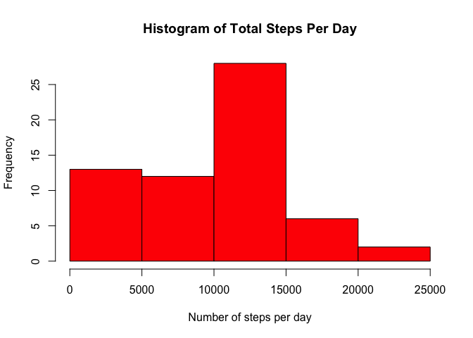
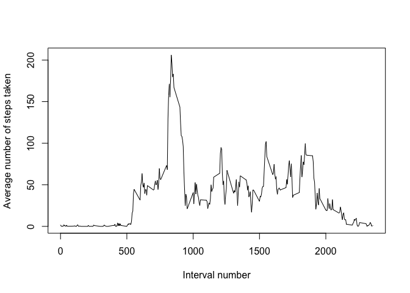
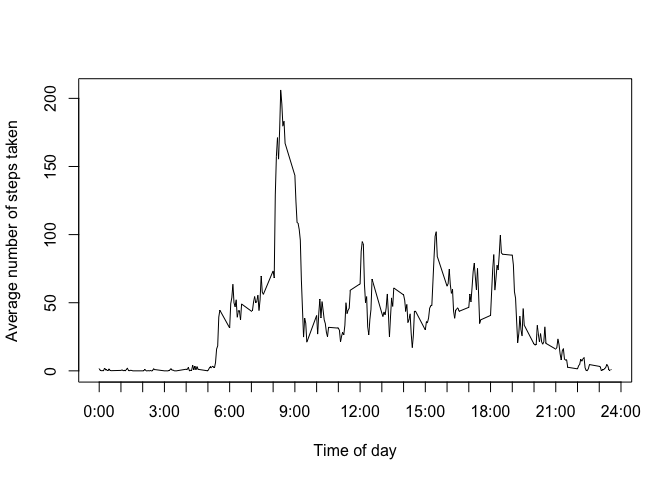
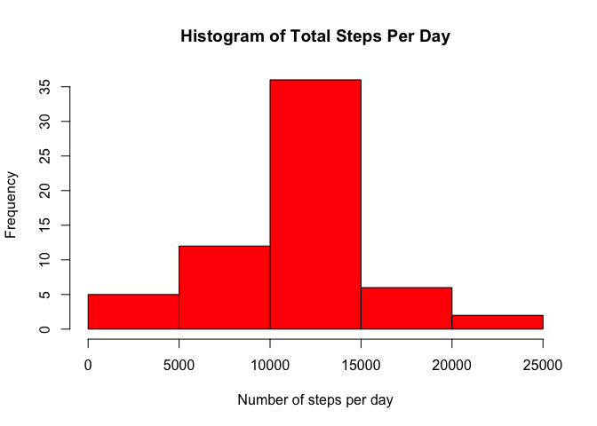
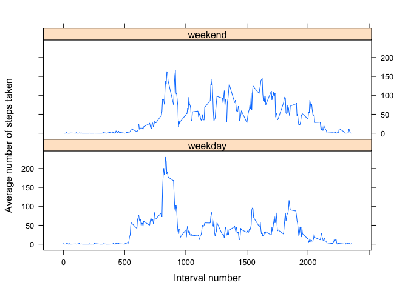
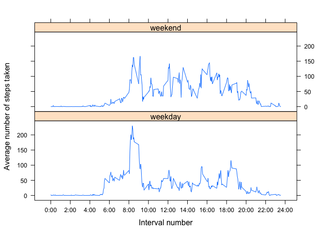

# Reproducible Research: Peer Assessment 1
  


In this document, we report the work that we did on analyzing activity data recorded over a time period of 61 days. The data can be found [here][1].

## Loading and preprocessing the data

The first step we did was to load the data. For simplicity, we loaded all the data in the form of characters.

```r
activity.data <- read.csv("activity.csv", colClasses = "character") # read data and save them into activity.data
```

We also used the data to compute a number of metrics that we used extensively in the subsequent sections. These metrics included the number of days of monitoring and the number of daily intervals.

```r
num.days <- length(unique(activity.data$date)) # find number of days of monitoring
day.activity.data <- split(activity.data, as.Date(activity.data$date)) # split data per day
daily.intervals <- day.activity.data[[1]]$interval # 5-minute intervals
num.intervals <- length(daily.intervals) # find number of 5-min intervals per day
```

## What is mean total number of steps taken per day?

The first measure we were interested in analyzing was the average total number of steps taken per day. So we started off by creating a vector of length 61, each entry representing the total number of steps taken per day of the monitoing period.  


```r
total.steps <- rep(NA, by = num.days) # initalize a vector of total number of steps per day

# calculate the number of steps per day
for (i in 1:num.days) {
        total.steps[i] <- sum(as.numeric(day.activity.data[[i]]$steps), na.rm = TRUE)
}
```

Here we plot a histogram that shows the distribution of the total steps taken per day.


```r
hist(total.steps, xlab = "Number of steps per day", col = "red", main = "Histogram of Total Steps Per Day")
```

 

```r
steps.mean <- format(mean(as.numeric(total.steps), na.rm = TRUE), scientific = FALSE) # compute and report the mean
steps.median <- format(median(as.numeric(total.steps), na.rm = TRUE), scientific = FALSE) # compute and report the median
```
According to the above histogram, the mean and the median of the steps taken per day are 9354.23 and 10395 steps, respectively.

## What is the average daily activity pattern?

Next, we were interested in visualizing the average daily activity pattern. To do that, we grouped the number of steps, taken every 5 minutes on each day, in a matrix, where each row represented the number of steps recorded in a day.


```r
activity.matrix <- matrix(nrow = num.days, ncol = num.intervals) # initialize a matrix of daily activity where each row represents a day

# populate the matrix
for (i in 1:num.days){
        activity.matrix[i,] <- as.numeric(day.activity.data[[i]]$steps)
}
```

Then we averaged the number of steps across all 61 days of monitoring.


```r
interval.means <- apply(activity.matrix, 2, mean, na.rm = TRUE) # compute the mean of total steps taken for each 5-minute interval
```

Here is a plot of the averaged number of steps across all days for each 5-minute interval.


```r
plot(interval.means ~ as.numeric(daily.intervals), type = "l", xlab = "Interval number", ylab = "Average number of steps taken") # plot average number of steps taken 
```

 

To make it easier for us to relate the number of steps taken to the different time intervals, we modify the horizontal axis to show hours of the day as shown in the next plot.


```r
tick.values <- seq(0, 2400, by = 100) # a vector of ticks values
hours <- seq(0, 24, by = 1)
tick.labels <- paste(hours, ":00", sep = "") # a vector of ticks labels 

plot(interval.means ~ as.numeric(daily.intervals), type = "l", xlab = "Time of day", ylab = "Average number of steps taken", xaxt = "n") # plot average number of steps taken against 5-minute intervals
axis(1, at = tick.values, labels = tick.labels)
```

 

Then we found the interval during which the maximum average number of steps were taken.


```r
max.num.steps <- signif(as.numeric(max(interval.means)), digits = 5) # find maximum number of steps taken per interval
max.interval.num <- which.max(interval.means) # find interval number with maximum number of steps taken
max.interval <- daily.intervals[max.interval.num] # find the interval with the maximum number of steps taken
```

According to the above plots of daily activity pattern, we found that a maximum of 206.17 steps was registerd during the 104 interval, which is equivalent to interval 835. 

## Imputing missing values

So far, in all the analysis that we reported, we ignored any missing values. In this section, we discuss another approach that we implemented to address missing values. 

Firt, we computed the total number of missing values and we found the positions of these missing values in the original dataset.

```r
NA.logical <- is.na(activity.data$steps) # logical vector of positions of missing values in original dataset
NA.total <- sum(NA.logical) # total number of missing values
NA.inds <- which(is.na(activity.data$steps)) # find the indices of the missing values
```

So we found that a total of 2304 values were missing from the original dataset.  

In order to proceed, we copied the original dataset in order to create a new dataset with the missing values filled.

```r
activity.data.filled <- activity.data # copy the original activity dataset
```

However, we found that if values were missing on a certain day, then the number of steps were missing for all 5-minute intervals on that day. In total, values were missing for 8 full days. To fill in the missing values, we replaced any missing value pertaining to a particular 5-minute interval with the mean number of steps taken in that interval.


```r
NA.inds.mod <- NA.inds %% num.intervals # take modulo of indices with respect to the number of intervals
NA.inds.mod[NA.inds.mod == 0] <- num.intervals # replace 0s with the total number of interval per day since this represents the last interval in a day

activity.data.filled$steps[NA.inds] <- interval.means[NA.inds.mod] # impute missing vlaues
```

Then we repeated the same processing that we did with the original dataset to explore any potential difference, now that the missing values have been inputed. So we first split the activity dataset into daily subsets. Then we computed the total number of steps taken per day, plotted a histogram of the total number of steps taken, and computed the resulting mean and median.


```r
day.activity.data.filled <- split(activity.data.filled, as.Date(activity.data.filled$date)) # split data per day
total.steps <- rep(NA, by = num.days) # initalize a vector of total number of steps per day
# calculate the number of steps per day
for (i in 1:num.days) {
        total.steps[i] <- sum(as.numeric(day.activity.data.filled[[i]]$steps))
}
hist(total.steps, xlab = "Number of steps per day", col = "red", main = "Histogram of Total Steps Per Day")
```

 

```r
steps.mean.new <- format(mean(as.numeric(total.steps)), scientific = FALSE) # compute and report the mean
steps.median.new <- format(median(as.numeric(total.steps)), scientific = FALSE) # compute and report the median
```

We found that the new mean and median were 10766.19 and 10766.19 steps, respectively. Imputing missing values resulted in higher mean and median values. More concretely, the mean increased by approximately 1412 steps and the median increased by approximately 371 steps.

Furthermore, imputing missing values as the average number of steps taken for the corresponding 5-minute interval resulted in equal mean and median number of steps taken per day, 10766.19 steps. This was a very interesting finding.

## Are there differences in activity patterns between weekdays and weekends?

Finally, we were interested in exploring whether differences existed between weekday activity patterns and weekend activity patterns.  

To stary off, we created a vector containing the days Monday to Friday to represent the week days and another vector containg Saturday and Sunday to represent the weekend days. Then we added an extra column to the data set indicating whether the corresponding day is a week day or a weekend day.

```r
week.days <- c("Monday", "Tuesday", "Wednesday", "Thursday", "Friday") # vector of weekdays
weekend.days <- c("Saturday", "Sunday") # vector of weekend days

activity.data.filled$day_type <- rep(NA, nrow(activity.data.filled)) # add an extra column to data frame to indicate type of day
week.days.ind <- (weekdays(as.Date(activity.data.filled$date)) %in% week.days) # create a logical vector indicating type of day        

# fill in type of day
activity.data.filled$day_type[week.days.ind] <- "weekday"
activity.data.filled$day_type[!week.days.ind] <- "weekend"
```

Then we computed the average number of steps taken for each 5-minute interval averaged across all week days and the average number of steps taken for each 5-minute interval averaged across all weekend days.


```r
day.activity.data.filled <- split(activity.data.filled, as.Date(activity.data.filled$date)) # split data into daily datasets
weekday.activity.matrix <- matrix(nrow = 0, ncol = num.intervals) # initialize a matrix of week days daily activity where each row represents a day
weekend.activity.matrix <- matrix(nrow = 0, ncol = num.intervals) # initialize a matrix of weekend days daily activity where each row represents a day

# populate both matrices matrix
for (i in 1:num.days){
        if(day.activity.data.filled[[i]]$day_type[1] == "weekday"){
                weekday.activity.matrix <- rbind(weekday.activity.matrix, as.numeric(day.activity.data.filled[[i]]$steps))
        }else{
                weekend.activity.matrix <- rbind(weekend.activity.matrix, as.numeric(day.activity.data.filled[[i]]$steps))
        }
}

weekday.interval.means <- format(apply(weekday.activity.matrix, 2, mean), scientific = FALSE) # compute the mean of total steps taken for each 5-minute interval averaged across all week days
weekend.interval.means <- format(apply(weekend.activity.matrix, 2, mean), scientific = FALSE) # compute the mean of total steps taken for each each 5-minute interval averaged across all weekend days
```

The following plot shows the estimated means of steps taken on week days and on weekends. The top plot shows the mean steps taken for each 5-minute interval on weekends whereas the bottom plot shows the mean steps taken for each 5-minute interval on week days.


```r
library(lattice)
means.df <- data.frame(means = as.numeric(c(weekday.interval.means, weekend.interval.means)), interval = as.numeric(day.activity.data[[1]]$interval), day_type = rep(c("weekday", "weekend"), each = num.intervals))

xyplot(means.df$means ~ means.df$interval | factor(means.df$day_type), layout = c(1, 2), type = "l", xlab = "Interval number", ylab = "Average number of steps taken")
```

 

In order to make it easier for us to relate the means of steps taken to the different time intervals, we modified the horizontal axis to show the hour of day.


```r
tick.values <- seq(0, 2400, by = 200) # a vector of ticks values
hours <- seq(0, 24, by = 2)
tick.labels <- paste(hours, ":00", sep = "") # a vector of ticks labels 

xyplot(means.df$means ~ means.df$interval | factor(means.df$day_type), layout = c(1, 2), type = "l", xlab = "Interval number", ylab = "Average number of steps taken", scales = list(x = list(at = tick.values, labels = tick.labels)))
```

 


As the above plots show, we are able to see significant differences between activity patterns on week days and on the weekend. For example, we are able to visualize a distinct peak in the week days activity pattern. This peak represents the maximum average number of steps recorded on a week day, which is 230.38 steps between 8AM and 9AM. This peak is absent in the weekend activity pattern. This high number of steps taken most likely represents the subject getting ready and/or walking to work in the morning.

Furthermore, this high peak of activity on a week day is followed by a period of low activity which most likely represents the subject being at work, and therefore, takes fewer number of steps overall. On the the hand, the subject exhibits a higher level of activity on a weekend day. Actually, the subject does so subject almost consistently from 8AM until 9PM. However, this level peaks at 166.64 steps, which is less than the maximum average number of steps taken on a weekday. Overall, the subject clearly takes more steps on a typical weekend day, a total of 12201.52 steps, than they do on a typical week day, a total of 10255.85 steps.


[1]: https://d396qusza40orc.cloudfront.net/repdata%2Fdata%2Factivity.zip "here"
